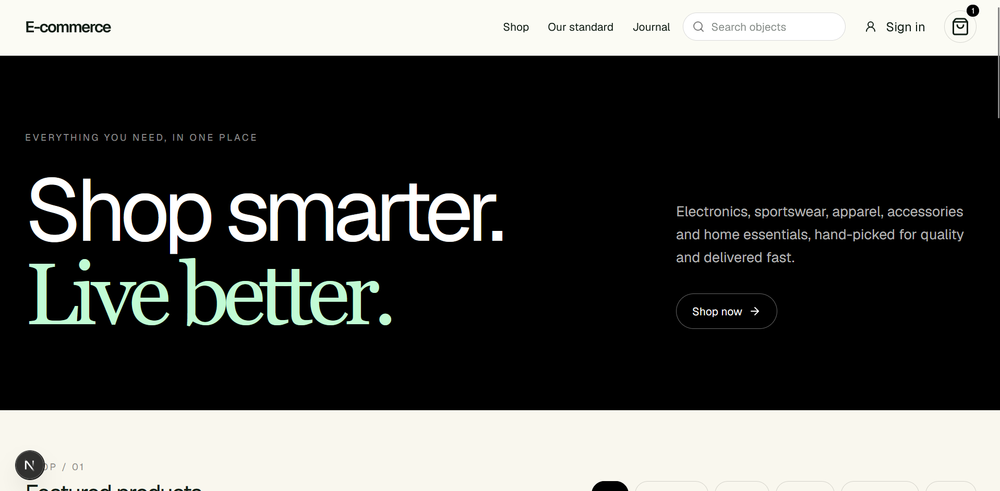
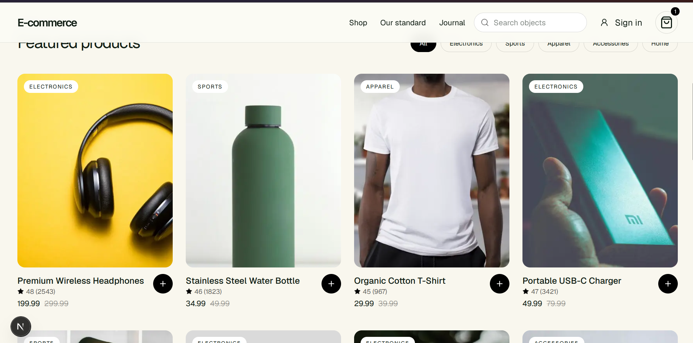
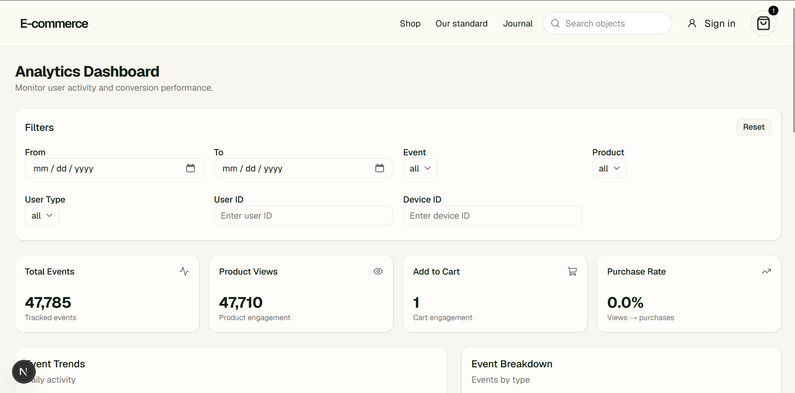
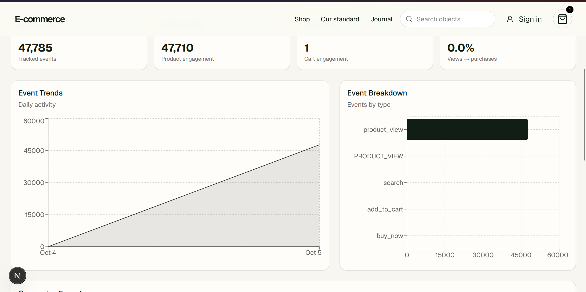
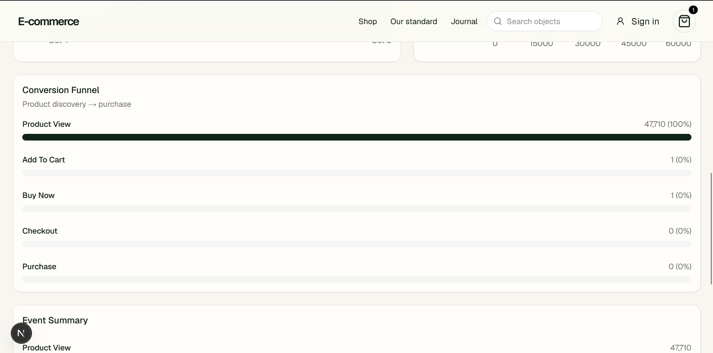
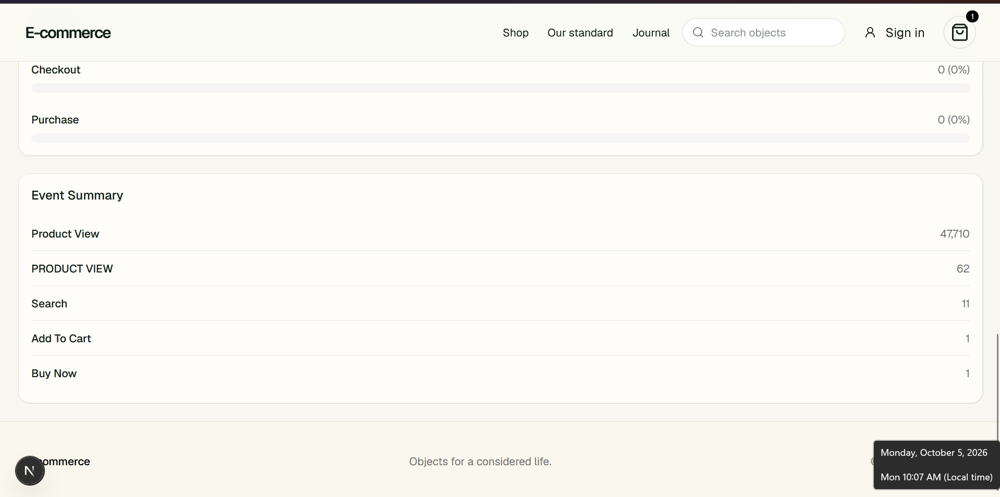
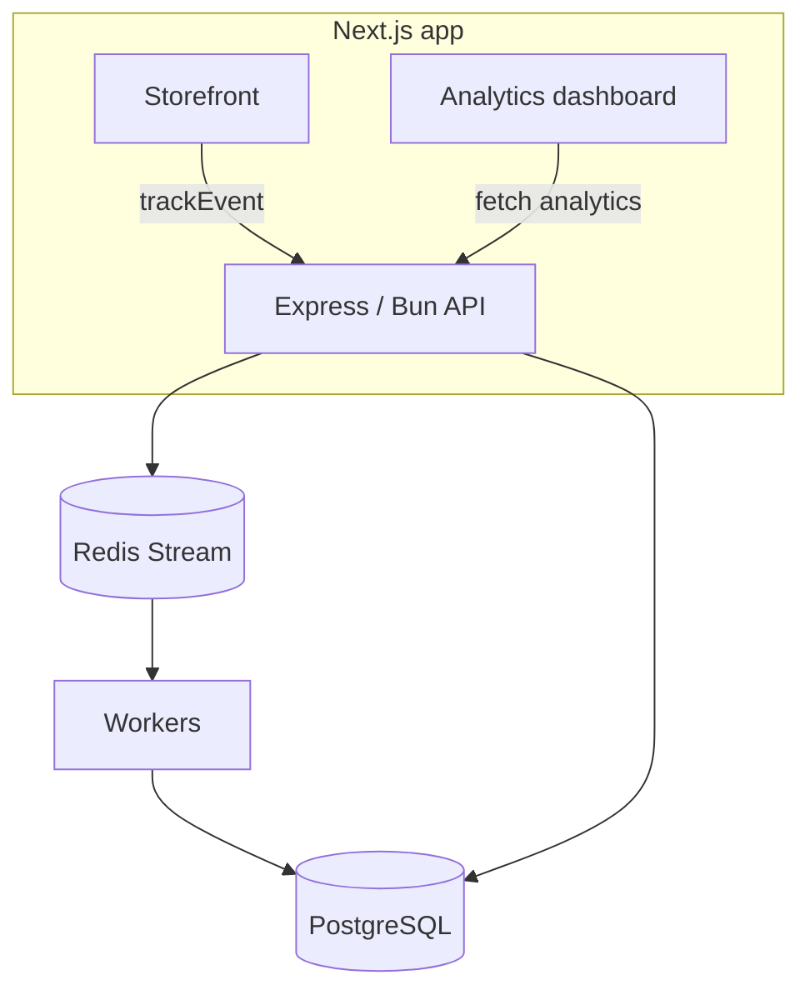

# Analytics Frontend

The storefront and analytics dashboard for the e-commerce analytics system. It does two jobs:

1. **A working e-commerce app** (browse, search, cart, checkout) that generates tracking events as people use it.
2. **An analytics dashboard** at `/analytics` that turns those events into stats, trends, a conversion funnel and per-user activity.

**Stack:** Next.js · React · TypeScript · Tailwind CSS · shadcn/ui · Recharts · Zustand · Zod · Lucide

This is the frontend half of the project. The API, Redis pipeline and database live in the backend repo and must be running for the dashboard to show data.

---

## Contents

- [Screenshots](#screenshots)
- [Getting started](#getting-started)
- [How tracking works](#how-tracking-works)
- [The storefront](#the-storefront)
- [Accounts and the guest-to-user flow](#accounts-and-the-guest-to-user-flow)
- [The analytics dashboard](#the-analytics-dashboard)
- [Architecture](#architecture)

Every section ends with a **Next** note describing what's still missing or worth improving in that area.

---

## Screenshots

| Storefront | Product grid |
|:--:|:--:|
|  |  |
| **Dashboard: filters and stats** | **Dashboard: trends and breakdown** |
|  |  |
| **Dashboard: conversion funnel** | **Dashboard: event summary** |
|  |  |

---

## Getting started

### Prerequisites

- [Bun](https://bun.sh) (or Node.js)
- The backend running on port `8080` (API, PostgreSQL, Redis and at least one event worker)

### Install and run

```bash
bun install
bun run dev
```

Open the URL Next.js prints (usually `http://localhost:3000`).

### Environment

Create `.env.local`:

```env
NEXT_PUBLIC_BACKEND_URL=http://localhost:8080
BACKEND_URL=http://localhost:8080
```

| Variable | Used by |
|---|---|
| `NEXT_PUBLIC_BACKEND_URL` | Code that runs in the browser, such as event tracking and the dashboard |
| `BACKEND_URL` | Server-side code, such as the cached product fetches |

### Project structure

```text
.
├── src/
│   ├── app/                  # routes, including /analytics
│   ├── components/
│   ├── lib/
│   │   └── analytics/
│   │       └── session.ts    # session handling
│   └── ...
├── docs/                     # screenshots used in this README (ss1 to ss6)
├── public/
├── package.json
└── .env.local
```

> **Next:** add a `.env.example` so new contributors don't have to guess the variables, and validate the env values at startup so a missing `BACKEND_URL` fails loudly instead of silently returning empty pages.

---

## How tracking works

Every user action goes through one reusable function, `trackEvent()`, which builds the event and sends it to the backend.

```text
User action → React component → trackEvent() → POST /api/v1/events → Backend
```

Each event carries:

| Field | Source |
|---|---|
| `eventId` | a fresh UUID per event, so the backend can safely ignore retries of the same event |
| `eventName` | what happened (`product_view`, `add_to_cart`, …) |
| `sessionId` | from the session utility (below) |
| `productId` | when the event is about a product |
| `properties` | extra context such as `quantity` or `priceMinor`, kept as JSON rather than separate columns |
| `occurredAt` | when it happened in the browser |

The browser sends cookies with each request, and the backend uses them to keep a stable **device ID**. The frontend never rewrites old events when someone logs in.

### Sessions

A session ends after about **30 minutes of inactivity**. The session utility records the time of the last activity, and the next action after the timeout starts a new session. The device ID stays the same throughout, so one device can have many sessions:

```text
One device ─┬─ Session 1
            ├─ Session 2
            └─ Session 3
```

### Events tracked

| Stage | Events |
|---|---|
| Discovery | `product_view`, `search`, `category_click` |
| Intent | `add_to_cart`, `remove_from_cart`, `wishlist` |
| Purchase | `buy_now`, `checkout`, `payment`, `purchase` |

> **Next**
> - **Event name casing.** The dashboard shows both `product_view` (47,710) and `PRODUCT VIEW` (62) as separate events (see the trends and event summary screenshots). Some call sites send uppercase names. Normalize names in `trackEvent()` using a typed `EventName` union so a typo fails at compile time, and have the backend reject anything outside the allowed list.
> - **Delivery reliability.** Send events with `navigator.sendBeacon` when the page is closing, queue failed sends and retry them (the `eventId` already makes retries safe), and batch events instead of one request each.
> - **Consent.** Add a consent banner and an opt-out switch that disables `trackEvent()` before shipping to real users.

---

## The storefront

### Home and product grid

The home page has the hero, category filters (All, Electronics, Sports, Apparel, Accessories, Home) and a product grid. Products come from the backend and are **cached by Next.js** (`force-cache`) with cache tags, so the list and each product page don't hit the API on every request.


### Search

Search is debounced. The request goes out about 300 ms after the user stops typing, and the timer resets on every keystroke, so typing "headphones" doesn't make ten requests. After the search runs, a `search` event is tracked with the query stored in `properties`.

### Product page

Opening a product page tracks `product_view` with the product ID. A missing or invalid ID shows the not-found page.

### Cart, buy now and checkout

| Action | Event | Properties |
|---|---|---|
| Add to cart | `add_to_cart` | `quantity`, `priceMinor` |
| Remove from cart | `remove_from_cart` | `quantity`, `priceMinor` |
| Buy now | `buy_now` | product and quantity |
| Start checkout | `checkout` | `itemCount`, `total`, `buyNow` |
| Payment attempt | `payment` | `amountMinor`, `status` |
| Order placed | `purchase` | `orderId`, `amountMinor` |

Checkout is a three-step flow: delivery address, review, then a **demo payment** screen where you choose to simulate success or failure. No real payment is taken, which makes it easy to test both outcomes and see them in the funnel.

> **Next**
> - **Rating display.** The product cards show ratings like `48 (2543)` instead of `4.8 (2543)`. The value is stored multiplied by 10 in the database, so the card needs to divide by 10 (or the column should become a decimal).
> - **Price formatting.** Cards show raw numbers such as `199.99`. Use the same `money()` helper the cart uses so every price has a currency symbol and consistent formatting.
> - **Real payments.** Replace the demo screen with a payment provider (Stripe or Razorpay, for example) and create the order on the server, not in the browser. The order ID shown after a successful demo payment is generated on the client.
> - **Inventory.** Show stock levels, such as "Low stock", and stop checkout when an item is sold out.
> - **Accessibility.** Add focus states and ARIA labels to the icon-only buttons (add to cart, remove) and test with a screen reader.

---

## Accounts and the guest-to-user flow

Visitors can browse and generate events without an account. When someone registers or logs in, the identity changes like this:

```text
Guest         deviceId = D1   sessionId = S1   userId = null
   │
   │  register / login
   ▼
Logged in     deviceId = D1   sessionId = S1   userId = U1
```

The earlier guest events stay as they are. The backend links device D1 to user U1, so the dashboard can show the user's full history, including what they did before signing up.

**Pages**

- `/login` and `/register` share one design system and link to each other.
- Forms are validated with **Zod** before anything is sent: valid email, a password of at least 8 characters with a letter and a number, and a matching confirmation. Errors appear under each field and clear as the user edits.
- Server errors (wrong credentials, email already registered) show in a message above the submit button.
- The signed-in user lives in a small **Zustand** store with `setUser`, `getUser` and `removeUser`. An `AuthProvider` checks `/api/auth/me` once on load to restore the session.

> **Next**
> - **Role-based access.** Add a `role` to the user and use it to protect the dashboard (details in the next section).
> - **Token storage.** Keep tokens in `httpOnly` cookies set by Next.js route handlers, not in JavaScript-accessible storage.
> - **Reuse the schemas on the server.** Run the same Zod schemas in the backend, because client-side validation can be bypassed.
> - **Account features.** Password reset, email verification, and an order history page.

---

## The analytics dashboard

The dashboard lives at `/analytics`. It's a client-side page, because it needs interactive filters and live chart rendering. All the numbers come from backend analytics endpoints, so the browser never downloads the raw event table to calculate them. The page fetches events, funnel and trends **in parallel** with `Promise.all`, and shows a loading state while waiting and an error state if a request fails.

### Filters and summary cards


Filters are turned into query parameters and sent to the API:

| Filter | Purpose |
|---|---|
| From / To | date range |
| Event | a single event type |
| Product | a single product |
| User type | guest, logged in, or all |
| User ID | one user's activity (direct events plus guest events from their linked devices) |
| Device ID | one device's activity |
| Reset | clears everything |

The four cards at the top show **Total Events**, **Product Views**, **Add to Cart** and **Purchase Rate** (views to purchases).

> **Next**
> - **Test data skews the numbers.** In the screenshot, 47,785 total events and 47,710 product views are mostly traffic from the backend load-test scripts, which is why Purchase Rate reads 0.0%. Tag load-test traffic (for example by device ID prefix) and exclude it from the dashboard by default.
> - **Date presets.** Add "Today", "Last 7 days" and "Last 30 days", plus a custom date and time range.
> - **Saved filters and export.** Let people save a filter set and download the current view as CSV or JSON.
> - **Shareable URLs.** Store the filters in the URL query string so a view can be bookmarked or sent to someone.

### Trends and event breakdown


**Event Trends** plots daily activity for `product_view`, `add_to_cart`, `checkout` and `purchase` using Recharts. **Event Breakdown** shows the count of each event type as horizontal bars.

> **Next**
> - **Chart readability.** With only two days of data (Oct 4 to Oct 5), the trend looks like a straight ramp. Add hourly granularity for short ranges and plot each event as its own line so small series are visible.
> - **Breakdown scale.** One event type dominates, so `search`, `add_to_cart` and `buy_now` show as empty bars. A log scale, value labels on each bar, or a "hide dominant series" toggle would fix this.
> - **Duplicate labels.** `product_view` and `PRODUCT_VIEW` appear as two rows. Fixing the casing at the source (see [How tracking works](#how-tracking-works)) removes this.

### Conversion funnel


The funnel shows where people drop off between discovering a product and buying it:

```text
Product View → Add to Cart → Checkout → Purchase
```

The dashboard also lists **Buy Now** as a row. It's a shortcut that skips the cart rather than a step between the others, so it behaves differently from the rest of the funnel.

> **Next**
> - **Small percentages round to 0%.** One add-to-cart out of 47,710 views displays as `1 (0%)`. Show two decimals or "<0.01%".
> - **Treat Buy Now as its own path.** Show it as a branch beside Add to Cart that joins at Checkout, so the funnel reads correctly.
> - **Step-to-step rates.** Show the drop-off between each pair of steps, not only the percentage of the first step.
> - **Funnel by session.** Count a user once per session so repeated views don't inflate the top of the funnel.

### Event summary and activity timeline


**Event Summary** lists every event type with its count. Searching by **User ID** or **Device ID** opens that person's **timeline**: each event with its name, guest or logged-in label, device, session, user and product IDs, properties and timestamp. For a user, the list also includes guest events from any device linked to them, which makes it possible to follow a whole journey:

```text
Product View → Search → Add to Cart → Checkout → Payment → Purchase
```

> **Next**
> - **Access control.** The dashboard is currently reachable by any visitor. Check the signed-in user's role, allow only admins, and redirect everyone else. The backend needs the same check on its analytics endpoints.
> - **Paginate the timeline.** Load 50 events at a time with a "Load more" button, and virtualize the list for very long histories so only visible rows are rendered.
> - **Richer metrics.** Unique users, devices and sessions; average session length; cart and checkout abandonment; revenue and revenue per user; top products and categories. Calculate these in backend queries, not in the browser.
> - **Live updates.** Push new events to the dashboard over WebSocket or Server-Sent Events so it updates without a refresh.
> - **Timeline screenshot.** Add a screenshot of the user timeline to the docs folder, since it isn't shown above.

---

## Architecture



```text
User action → component → trackEvent() → POST /api/v1/events → Redis → workers → PostgreSQL
                                                                                    │
Dashboard ← charts, funnel, timeline ← analytics API ←──────────────────────────────┘
```

> **Next: testing.** The backend has integration and load scripts, but the frontend has none yet. A reasonable order: unit tests for `trackEvent()` and the session logic, component tests for the forms and filters, then an end-to-end test (Playwright) that walks open product, search, add to cart, checkout, payment, purchase, and asserts that the expected events reached the API.